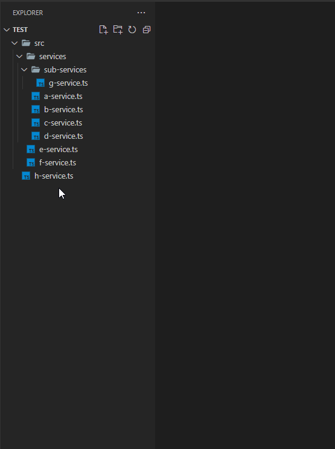

# typescript-indexing

An extension for auto-generating index.ts files for indexing one or more files inside a folder or sub-folders

## Features

Generates a index.ts file containing appropriate exports.
Deep-Generates index.ts files for sub-folders.
